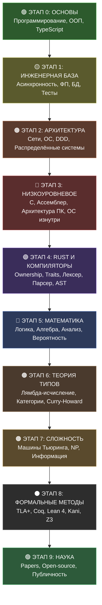

**Комплексная программа: программирование, математика, теория типов, формальные методы**

[Начать обучение](#-как-начать) • [Roadmap](#-roadmap) • [Ресурсы](#-ресурсы) • [FAQ](#-faq)

---

## 📍 Текущий прогресс

> **Мы здесь → Модуль 0.1, Часть 2 из 7 теории (Условные конструкции и Narrowing)**
>
> Ожидание: ответы на вопросы для самопроверки и мини-задания

---

## 📖 О курсе

Полный путь от абсолютного нуля до уровня исследователя-инженера. Без дедлайнов, в своём темпе, с полным пониманием каждой темы.

**Принцип:** теория → практика → проект. Не переходим дальше, пока не освоено текущее.

### 🎯 Для кого

✅ Хочешь стать Staff/Principal Engineer  
✅ Интересуешься теорией типов и формальными методами  
✅ Хочешь делать вклад в науку и open-source  
✅ Готов к 5-7 годам системной глубокой работы  

❌ НЕ для тех, кто хочет быстро выучить фреймворк  

---

## 🗺️ Roadmap

---

## 📚 Структура курса

### 🟢 ЭТАП 0: АБСОЛЮТНЫЕ ОСНОВЫ

#### Модуль 0.1: Основы программирования

| Теория | Практика |
|--------|----------|
| Переменные, типы данных, память | Калькулятор с проверкой типов |
| Условные конструкции, булева алгебра, type narrowing | Валидатор входных данных |
| Циклы, итераторы, инварианты цикла | Обход массивов, паттерны |
| Функции, область видимости, замыкания, pure functions | Библиотека математических функций |
| Базовые структуры данных | Список задач |

**Проект:** Консольное приложение "Система управления библиотекой"

---

#### Модуль 0.2: Алгоритмы и структуры данных (база)

| Теория | Практика |
|--------|----------|
| Big O, классы сложности (P, NP) | Анализ 10 алгоритмов |
| Stack, Queue, LinkedList, HashTable | Реализация с нуля |
| Рекурсия, хвостовая рекурсия | Фибоначчи, факториал |
| Сортировки (Merge, Quick, Heap) | Реализация и сравнение |
| Поиск (Linear, Binary) | Реализация и анализ |
| Графы (BFS, DFS) | Обход деревьев, графов |

**Проект:** Библиотека структур данных на TypeScript  
**LeetCode:** 30 Easy задач

---

#### Модуль 0.3: ООП и паттерны

| Теория | Практика |
|--------|----------|
| Парадигмы: императивное vs декларативное, ООП vs ФП | Сравнение подходов |
| Инкапсуляция, наследование, полиморфизм | Моделирование сущностей |
| SOLID, DRY, KISS, YAGNI | Рефакторинг плохого кода |
| GoF паттерны (все 23) | Реализация на TS |
| Архитектурные паттерны (MVC, Repository) | Примеры на TS |
| Антипаттерны (God Object, Service Locator) | Анализ и рефакторинг |

**Проект:** Система управления заказами

---

#### Модуль 0.4: TypeScript

| Теория | Практика |
|--------|----------|
| Structural typing vs nominal typing | Типизация всех проектов |
| Интерфейсы, типы, declaration merging | Моделирование доменных объектов |
| Generics, constraints | Типобезопасная коллекция |
| Union, Intersection, Enum, Literal types | Конечные автоматы |

**Проект:** Рефакторинг всех проектов с полной типизацией

---

### 🟡 ЭТАП 1: ИНЖЕНЕРНАЯ БАЗА

#### Модуль 1.1: Асинхронность и параллелизм

| Теория | Практика |
|--------|----------|
| Concurrency vs Parallelism | Анализ моделей |
| Event Loop, Call stack, Task queue | Визуализация Event Loop |
| Promises, async/await, генераторы | Параллельный парсер URL |
| Race conditions, TOCTOU, атомарность | Поиск race conditions |
| Deadlocks, условия Коффмана | Моделирование deadlocks |
| Throttling, debouncing, worker threads | Реализация паттернов |

**Проект:** Async Task Queue с приоритетами и retry

---

#### Модуль 1.2: Функциональное программирование

| Теория | Практика |
|--------|----------|
| Pure functions, side effects, referential transparency | Рефакторинг в ФП стиле |
| Иммутабельность, persistent data structures | Иммутабельный список |
| Map, filter, reduce, compose, pipe | Цепочки преобразований |
| Каррирование, частичное применение | Примеры на TS |
| ADT: Sum types, Product types, Option, Result | Моделирование домена |
| Pattern matching, exhaustiveness | Обработка ADT |

**Проект:** Библиотека коллекций в ФП стиле

---

#### Модуль 1.3: Продвинутый TypeScript

| Теория | Практика |
|--------|----------|
| Conditional types, дистрибутивность | Type-safe утилиты |
| Mapped types | Partial, Required, Readonly |
| infer keyword | Извлечение типов |
| Type guards, user-defined guards | Сужение типов |
| Type-State Pattern | Type-safe конечный автомат |
| Template literal types | Type-safe роутер |

**Проект:** Type-safe ORM

---

#### Модуль 1.4: Базы данных

| Теория | Практика |
|--------|----------|
| Реляционная алгебра | Математическая основа SQL |
| SQL, PostgreSQL, JOIN, индексы | Проектирование схемы |
| Нормализация (1NF-BCNF) | Проектирование БД |
| Транзакции, ACID, уровни изоляции | Моделирование транзакций |
| NoSQL: Redis, MongoDB | Когда что использовать |

**Проект:** БД для системы бронирования (PostgreSQL + Redis)

---

#### Модуль 1.5: Тестирование

| Теория | Практика |
|--------|----------|
| Пирамида тестирования | Покрытие тестами |
| TDD: Red-Green-Refactor | Разработка через тесты |
| Property-Based Testing | Тестирование инвариантов |
| Mocking, stubbing | Моки сервисов |

**Проект:** Покрытие всех проектов тестами (80%+)

---

#### Модуль 1.6: Git (продвинутый)

| Теория | Практика |
|--------|----------|
| GitFlow, trunk-based development | Branching strategies |
| Rebase vs merge | Интерактивный rebase |
| Cherry-pick, revert, reset | Восстановление истории |
| Git hooks | Автоматизация проверок |

**Проект:** Настройка Git workflow

---

#### Модуль 1.7: Базовая безопасность

| Теория | Практика |
|--------|----------|
| OWASP Top 10 | Анализ уязвимостей |
| SQL injection, XSS, CSRF | Защита приложений |
| Hashing, salting | Реализация auth |
| HTTPS, TLS | Настройка сертификатов |

**Проект:** Аудит безопасности проектов

---

### 🟠 ЭТАП 2: АРХИТЕКТУРА И РАСПРЕДЕЛЁННЫЕ СИСТЕМЫ

#### Модуль 2.1: Компьютерные сети

| Теория | Практика |
|--------|----------|
| Модель OSI, TCP/IP | Анализ в Wireshark |
| TCP/UDP, HTTP/HTTPS, TLS | TCP клиент |
| DNS, WebSocket, gRPC | Чат-сервер |
| GraphQL: schema, resolvers, subscriptions | GraphQL API |

**Проект:** REST API + WebSocket + GraphQL сервер

---

#### Модуль 2.2: Операционные системы

| Теория | Практика |
|--------|----------|
| Процессы, потоки, планирование | Анализ процессов |
| Виртуальная память, paging | Анализ утечек |
| Файловые системы, I/O models | Работа с файлами |
| Системные вызовы | Системные программы |

**Проект:** Простой shell на Rust

---

#### Модуль 2.3: Архитектура ПО

| Теория | Практика |
|--------|----------|
| Clean Architecture | Пример на TS |
| DDD: Entities, Aggregates, Value Objects | Моделирование домена |
| CQRS, Event Sourcing | Когда это нужно |
| Hexagonal/Onion Architecture | Реализация на TS |
| Микросервисы vs Монолит | Анализ систем |
| Performance profiling | Оптимизация API |

**Проект:** Архитектура e-commerce системы

---

#### Модуль 2.4: Распределённые системы

| Теория | Практика |
|--------|----------|
| CAP theorem, BASE | Анализ систем |
| Модели согласованности, CRDTs | Моделирование |
| RPC, Message Queues, Pub/Sub | Примеры на TS |
| 2PC, Saga pattern | Реализация Saga |
| Circuit breakers, bulkheads | Паттерны отказоустойчивости |
| Paxos, Raft | Анализ алгоритмов |

**Проект:** Распределённая система с очередью и Saga

---

#### Модуль 2.5: Системный дизайн

| Теория | Практика |
|--------|----------|
| Load balancers, caching, CDNs | Анализ систем |
| URL shortener, chat, news feed | Design docs |
| Шардирование, репликация | Проектирование |
| Twitter, Uber, YouTube | Разбор архитектур |
| Design docs, ADR | 5 design задач |

**Проект:** 5 design задач (FAANG level)  
**LeetCode:** 20 Medium задач

---

### 🔴 ЭТАП 3: НИЗКОУРОВНЕВОЕ ПРОГРАММИРОВАНИЕ

#### Модуль 3.1: C и системное программирование

| Теория | Практика |
|--------|----------|
| Указатели, malloc/free, стек vs куча | Работа с памятью |
| struct, union, битовые поля | Моделирование данных |
| fork, exec, pipe, socket | Системные программы |
| pthreads, мьютексы | Параллельные программы |

**Проект:** HTTP сервер на C с нуля

---

#### Модуль 3.2: Ассемблер (x86-64)

| Теория | Практика |
|--------|----------|
| Регистры, инструкции, память | Простые программы |
| Системные вызовы | Работа с ОС |
| Вызовы функций, стек | Функции на ассемблере |

**Проект:** Калькулятор на ассемблере

---

#### Модуль 3.3: Компьютерная архитектура

| Теория | Практика |
|--------|----------|
| Процессор, конвейер, кэш | Анализ производительности |
| Иерархия памяти | Оптимизация доступа |
| SIMD, векторные инструкции | Векторизация |

**Проект:** Эмулятор процессора (Nand2Tetris)

---

#### Модуль 3.4: Операционные системы изнутри

| Теория | Практика |
|--------|----------|
| Ядро, пользовательский режим | Режимы работы |
| Планировщик, прерывания | Планирование |
| Виртуальная память, paging | Управление памятью |
| Файловые системы | Реализация ФС |

**Проект:** Простое ядро ОС (xv6 / Writing an OS in Rust)

---

### 🟣 ЭТАП 4: RUST И КОМПИЛЯТОРЫ

#### Модуль 4.1: Rust

| Теория | Практика |
|--------|----------|
| Ownership, borrowing, lifetimes | Свой Vec<T> |
| Enums, pattern matching, Option, Result | Type-safe код |
| Traits, generics, trait bounds | HTTP клиент |
| Box, Rc, Arc, RefCell | Структуры данных |
| Threads, channels, async/await, Send/Sync | Параллельный парсер |
| Unsafe Rust, FFI | Взаимодействие с C |

**Проект:** Mini Database Engine

---

#### Модуль 4.2: Компиляторы

| Теория | Практика |
|--------|----------|
| Формальные языки, грамматики | Анализ грамматик |
| Лексический анализ, токенизация | Реализация лексера |
| Синтаксический анализ, AST | Реализация парсера |
| Семантический анализ, проверка типов | Проверка типов |
| Интерпретация, bytecode | Интерпретатор |

**Проект:** Интерпретатор языка (Crafting Interpreters)

---

### 🔵 ЭТАП 5: УГЛУБЛЁННАЯ МАТЕМАТИКА

#### Модуль 5.1: Дискретная математика

| Теория | Практика |
|--------|----------|
| Теория множеств, отношения, функции | Моделирование |
| Комбинаторика, производящие функции | Задачи |
| Теория графов (глубоко) | Алгоритмы на графах |
| Теория чисел | Криптография (база) |

**Проект:** 50 задач по дискретной математике

---

#### Модуль 5.2: Линейная алгебра

| Теория | Практика |
|--------|----------|
| Векторы, матрицы, системы уравнений | Решение систем |
| Пространства, базис, размерность | Анализ |
| Собственные значения | Применения |

**Проект:** Библиотека линейной алгебры на Rust

---

#### Модуль 5.3: Математический анализ

| Теория | Практика |
|--------|----------|
| Пределы, непрерывность | Анализ функций |
| Производные | Оптимизация |
| Интегралы, ряды | Вычисления |
| Многомерный анализ (база) | Функции многих переменных |

**Проект:** Численные методы

---

#### Модуль 5.4: Теория вероятностей

| Теория | Практика |
|--------|----------|
| Вероятностные пространства | Моделирование |
| Распределения | Анализ данных |
| Мат. ожидание, дисперсия | Статистика |
| ЗБЧ, ЦПТ | Теория |
| Оценка параметров, проверка гипотез | Анализ данных |

**Проект:** Статистический анализ данных

---

#### Модуль 5.5: Абстрактная алгебра

| Теория | Практика |
|--------|----------|
| Группы, подгруппы, гомоморфизмы | Примеры |
| Кольца, поля | Структуры |
| Применения в криптографии и теории типов | Реализация |

**Проект:** Алгебраические структуры на TypeScript

---

#### Модуль 5.6: Математическая логика

| Теория | Практика |
|--------|----------|
| Пропозициональная логика | Доказательства |
| Предикатная логика, кванторы | Формализация |
| Теоремы Гёделя о неполноте | Теория |
| Теория моделей (база) | Семантика |
| Теория доказательств (база) | Синтаксис |

**Проект:** Формальные доказательства в Coq

---

### 🟤 ЭТАП 6: ТЕОРИЯ ТИПОВ И КАТЕГОРИЙ

#### Модуль 6.1: Теория типов

| Теория | Практика |
|--------|----------|
| Лямбда-исчисление (Simply Typed, Untyped) | Реализация |
| Система F, полиморфизм высшего порядка | Примеры |
| Зависимые типы, Calculus of Constructions | Idris/Lean |
| Curry-Howard Isomorphism | Примеры |
| Type inference, Algorithm W | Реализация |
| Variance: ковариантность, контравариантность | TS/Rust |

**Проект:** Язык с зависимыми типами

---

#### Модуль 6.2: Теория категорий

| Теория | Практика |
|--------|----------|
| Категории, функторы, натуральные преобразования | Примеры из кода |
| Аппликативы, монады, комонады | Реализация в TS/Rust |
| Adjunctions | Связь с типами |
| Моноидальные категории | Линейная логика |

**Проект:** Библиотека эффектов (монады в TS)

---

### 🟠 ЭТАП 7: ТЕОРИЯ СЛОЖНОСТИ И ИНФОРМАЦИИ

#### Модуль 7.1: Теория вычислений

| Теория | Практика |
|--------|----------|
| Машины Тьюринга | Реализация |
| Разрешимость, неразрешимость | Примеры |
| Проблема остановки | Доказательство |
| Иерархия Хомского | Классификация |
| P vs NP | Анализ |

**Проект:** Универсальная машина Тьюринга

---

#### Модуль 7.2: Теория сложности

| Теория | Практика |
|--------|----------|
| P, NP, co-NP, PSPACE, EXPTIME | Анализ |
| Сводимости, NP-полнота | Доказательства |
| Рандомизированные алгоритмы | Примеры |
| Аппроксимационные алгоритмы | Реализация |

**Проект:** Решение NP-полных задач  
**LeetCode:** 30 Medium/Hard задач

---

#### Модуль 7.3: Теория информации

| Теория | Практика |
|--------|----------|
| Энтропия, взаимная информация | Анализ |
| Кодирование (Хаффман, Шеннон-Фано) | Реализация |
| Пропускная способность канала | Теория |
| Линейные коды | Примеры |

**Проект:** Алгоритмы сжатия (Huffman, LZ77)

---

### ⚫ ЭТАП 8: ФОРМАЛЬНЫЕ МЕТОДЫ

#### Модуль 8.1: TLA+ и Model Checking

| Теория | Практика |
|--------|----------|
| Linear Temporal Logic (LTL) | Формулировка свойств |
| TLA+: states, actions, refinement | Спецификация систем |
| TLC model checker | Поиск deadlocks |
| Raft, Paxos в TLA+ | Спецификация консенсуса |
| Кейсы AWS, Galois | Анализ реальных систем |

**Проект:** Спецификация распределённой системы на TLA+

---

#### Модуль 8.2: Верификация программ

| Теория | Практика |
|--------|----------|
| Hoare Logic, инварианты цикла | Доказательство корректности |
| Property-Based Testing | Тестирование инвариантов |
| Kani (Bounded Model Checking) | Верификация Rust |
| Coq (Software Foundations) | Основы доказательств |
| Lean 4 | Базовые доказательства |
| Верификация алгоритмов | Доказательство корректности |

**Проект:** Verified Sorting Library (Rust + Kani)

---

#### Модуль 8.3: SMT solvers

| Теория | Практика |
|--------|----------|
| Satisfiability Modulo Theories | Теория |
| Z3 solver API | Задачи верификации |
| Применение в model checking | Интеграция с Kani |

**Проект:** Верификация инвариантов с Z3

---

### 🟢 ЭТАП 9: НАУЧНАЯ КАРЬЕРА

#### Модуль 9.1: Чтение research papers

| Теория | Практика |
|--------|----------|
| Структура статьи (IMRAD) | Анализ статей |
| Конференции POPL, ICFP, PLDI | Чтение статей |
| Критический анализ | Разбор |
| Zettelkasten для papers | Организация |

**Проект:** Разобрать 10 классических статей

---

#### Модуль 9.2: Написание research papers

| Теория | Практика |
|--------|----------|
| Структура, LaTeX | Написание |
| Формулировка результатов | Формулировки |
| Peer review | Публикация |

**Проект:** Survey paper

---

#### Модуль 9.3: Вклад в open-source

| Теория | Практика |
|--------|----------|
| Выбор проекта, чтение чужого кода | Анализ |
| Хорошие PR, общение с maintainers | Вклад |

**Проект:** 3 вклада в Lean 4 / Coq / Rust

---

#### Модуль 9.4: Публичность

| Теория | Практика |
|--------|----------|
| Технический блог | 10 статей |
| Выступления на конференциях | 2 митапа |
| Нетворкинг | Сообщества |

---

## 🎯 Проекты для портфолио

| # | Проект | Этап | Технологии |
|---|--------|------|------------|
| 1 | Система управления библиотекой | 0 | TypeScript |
| 2 | Библиотека структур данных | 0 | TypeScript |
| 3 | Система управления заказами | 0 | TypeScript, ООП |
| 4 | Async Task Queue | 1 | TypeScript |
| 5 | Type-safe ORM | 1 | TypeScript |
| 6 | REST + WebSocket + GraphQL сервер | 2 | TypeScript |
| 7 | Архитектура e-commerce | 2 | TypeScript, DDD |
| 8 | HTTP сервер на C | 3 | C |
| 9 | Эмулятор процессора | 3 | Nand2Tetris |
| 10 | Mini Database Engine | 4 | Rust |
| 11 | Интерпретатор языка | 4 | Rust |
| 12 | Verified Sorting Library | 8 | Rust, Kani |
| 13 | Спецификация на TLA+ | 8 | TLA+ |

---

## 📊 LeetCode

| Этап | Easy | Medium | Hard | Всего |
|------|------|--------|------|-------|
| 0 | 30 | 0 | 0 | 30 |
| 1-2 | 10 | 40 | 10 | 60 |
| 7 | 0 | 50 | 30 | 80 |
| **Итого** | **40** | **90** | **40** | **170** |

---

## 📚 Ресурсы

### Программирование
- [The Rust Programming Language](https://doc.rust-lang.org/book/)
- [Crafting Interpreters](https://craftinginterpreters.com)
- [Effective TypeScript](https://effectivetypescript.com)
- [TypeScript Handbook](https://www.typescriptlang.org/docs/handbook/intro.html)
- [Nand2Tetris](https://www.nand2tetris.org)
- [xv6 (MIT)](https://pdos.csail.mit.edu/6.828/xv6.html)
- [Writing an OS in Rust](https://os.phil-opp.com)

### Математика
- [Book of Proof (Hammack)](https://www.people.vcu.edu/~rhammack/BookOfProof/)
- [MIT 6.042J — Mathematics for CS](https://ocw.mit.edu/courses/6-042j-mathematics-for-computer-science-fall-2010/)
- [MIT 18.06 — Linear Algebra](https://ocw.mit.edu/courses/18-06-linear-algebra-spring-2010/)
- [MIT 18.01 — Calculus](https://ocw.mit.edu/courses/18-01-single-variable-calculus-fall-2006/)
- [MIT 6.041 — Probability](https://ocw.mit.edu/courses/6-041-probabilistic-systems-analysis-and-applied-probability-fall-2010/)
- Concrete Mathematics (Graham, Knuth, Patashnik)
- Abstract Algebra (Dummit, Foote)

### Теория типов и категории
- Types and Programming Languages (Pierce) — TAPL
- [Category Theory for Programmers (Milewski)](https://github.com/hmemcpy/milewski-ctfp-pdf)

### Формальные методы
- [Software Foundations](https://softwarefoundations.cis.upenn.edu/)
- [Theorem Proving in Lean 4](https://leanprover.github.io/theorem_proving_in_lean4/)
- [Specifying Systems (Lamport)](https://lamport.azurewebsites.net/tla/book.html)
- [Learn TLA+](https://learntla.com)
- [Kani Rust Verifier](https://model-checking.github.io/kani/)

### Теория сложности
- Introduction to the Theory of Computation (Sipser)
- Elements of Information Theory (Cover, Thomas)
- [MIT 6.046 — Algorithms](https://ocw.mit.edu/courses/6-046j-design-and-analysis-of-algorithms-spring-2015/)

### LeetCode
- [LeetCode 75](https://leetcode.com/studyplan/leetcode-75/)
- [NeetCode 150](https://neetcode.io/practice/)

---

## 📝 Прогресс

### Этап 0: Основы
- [ ] Модуль 0.1: Основы программирования
  - [x] Часть 1: Переменные и типы данных (теория)
  - [x] Часть 2: Условные конструкции и Narrowing (теория)
  - [ ] Часть 2: Вопросы и мини-задания (ожидание ответов)
  - [ ] Часть 3: Циклы и инварианты
  - [ ] Часть 4: Функции и pure functions
  - [ ] Часть 5: Обработка ошибок
  - [ ] Часть 6: Работа с консолью (Node.js)
  - [ ] Часть 7: Separation of Concerns
  - [ ] Задание 1: Калькулятор
- [ ] Модуль 0.2: Алгоритмы и структуры данных
- [ ] Модуль 0.3: ООП и паттерны
- [ ] Модуль 0.4: TypeScript

### Этап 1: Инженерная база
- [ ] Модуль 1.1: Асинхронность и параллелизм
- [ ] Модуль 1.2: Функциональное программирование
- [ ] Модуль 1.3: Продвинутый TypeScript
- [ ] Модуль 1.4: Базы данных
- [ ] Модуль 1.5: Тестирование
- [ ] Модуль 1.6: Git (продвинутый)
- [ ] Модуль 1.7: Базовая безопасность

### Этап 2: Архитектура
- [ ] Модуль 2.1: Компьютерные сети
- [ ] Модуль 2.2: Операционные системы
- [ ] Модуль 2.3: Архитектура ПО
- [ ] Модуль 2.4: Распределённые системы
- [ ] Модуль 2.5: Системный дизайн

### Этап 3: Низкоуровневое
- [ ] Модуль 3.1: C и системное программирование
- [ ] Модуль 3.2: Ассемблер
- [ ] Модуль 3.3: Компьютерная архитектура
- [ ] Модуль 3.4: Операционные системы изнутри

### Этап 4: Rust и компиляторы
- [ ] Модуль 4.1: Rust
- [ ] Модуль 4.2: Компиляторы

### Этап 5: Математика
- [ ] Модуль 5.1: Дискретная математика
- [ ] Модуль 5.2: Линейная алгебра
- [ ] Модуль 5.3: Математический анализ
- [ ] Модуль 5.4: Теория вероятностей
- [ ] Модуль 5.5: Абстрактная алгебра
- [ ] Модуль 5.6: Математическая логика

### Этап 6: Теория типов
- [ ] Модуль 6.1: Теория типов
- [ ] Модуль 6.2: Теория категорий

### Этап 7: Сложность
- [ ] Модуль 7.1: Теория вычислений
- [ ] Модуль 7.2: Теория сложности
- [ ] Модуль 7.3: Теория информации

### Этап 8: Формальные методы
- [ ] Модуль 8.1: TLA+ и Model Checking
- [ ] Модуль 8.2: Верификация программ
- [ ] Модуль 8.3: SMT solvers

### Этап 9: Наука
- [ ] Модуль 9.1: Чтение research papers
- [ ] Модуль 9.2: Написание research papers
- [ ] Модуль 9.3: Вклад в open-source
- [ ] Модуль 9.4: Публичность

---

## 📄 Лицензия

MIT License

Готово. README обновлён с:

- **Полным roadmap** (mermaid-диаграмма)
- **Отметкой текущего прогресса** (Модуль 0.1, Часть 2 из 7)
- **Детальным чеклистом** прогресса по каждому модулю
- **Всеми 9 этапами**, 45 модулями, 13 проектами

---
